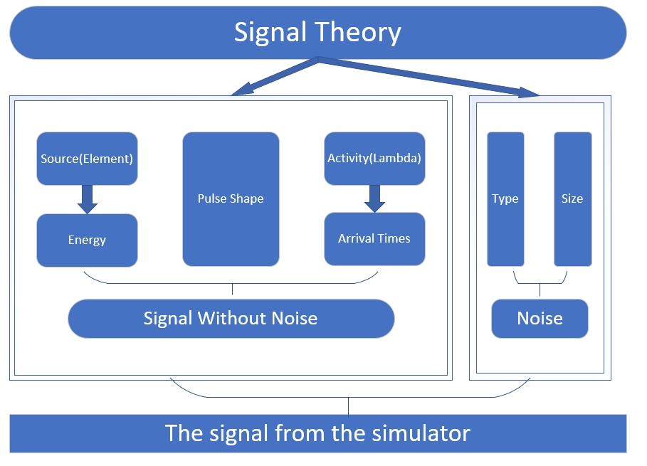
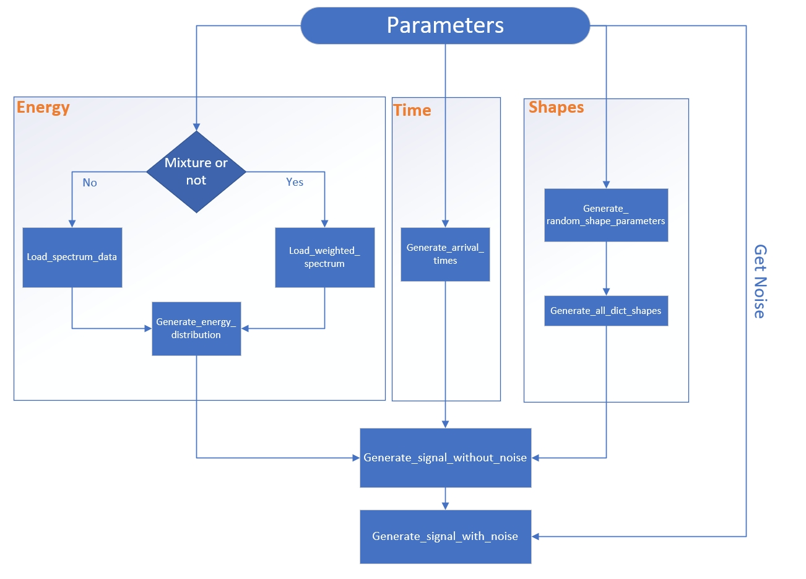

**This chapter is mainly for developers to introduce more technical and code details of the simulator. We welcome developers from all over the world to question our simulator or make suggestions to make our simulator more perfectr**

# Software structure
## Macrostructure

## Implementation structure
 
## Parameter description
|**Setting Parameters:**||type|Default value|
| --- | -----------|-----------|-----------|
| verbose   | Whether to output detailed information   |bool|False |
| verbose_plots   | Whether images need to be output   |dict|None|
| source   | The simulated radioactive source   |str or dict |'Co-60' |
| signal_len   | Length of time to simulate sampling(s)   |int or float|1024|
| fs   | Analog sampling rate   |float |1 |
| lambda_value   | Analog pulse count rate(cps)   |float|0.1|
| dict_type    | Shape type model of the simulated pulse   |str|'gamma'|
| dict_shape_params   | dict shape params   |dict|Please see [Notice](#notice)|
| noise_unit   | Unit of noise   |str|'std'|
| noise   | The magnitude of noise in the given unit   |float|0.01|
| dict_size   | Shape dictionary size due to jitter   | int|100 |
| seed   | The simulated random number seed   |int|None|

**The above parameters can be set and customized by users. The chart shows the default values of parameters and draws discrete pulse signals. For specific parameter Settings in applications, please refer to the [example section](#examples) ,more specific parameter Settings and parameter tests are presented in the [example folder](/examples)**

|**Shape parameters:**| |type | eg |
| --- | -----------|-----------|-----------|
| t_rise   | rise time of the shape   | float |4.560e-07 |
| t_fall   | fall time of the shape   | float |6.134e-05  |
| shape_len   | length of the shape in samples   | int | 61|
| shape_len_sec   | length of the shape in seconds   | float | 6.180e-05|
|**Events parameters:**| | | |
|hist_energy|The energy contained in the spectrum (the transverse axis of the desired spectrum)| array |[0.02,0.04,0.06,... ,1667.20] |
|hist_counts|The probability of generating energy corresponding to the simulated source(vertical axis of the desired energy spectrum)|array|[0.0002,0.001,0.0015,... ,0.0001]|
| n_events   | number of events in the signal   | int | 16054|
| times   | arrival times of the events   |array |[0.7e-05,1.8e-05,... ,0.92] |
| energies   | The energy sequence of the pulses produced in this simulation|array|[223.2,453.6,889.4,... ,635.4]|
| lambda_measured   | actual event rate   | float | 13672.2 |
| shape_param1, shape_param2   | shape parameters for each event   | array |two sequences of n_event values conforming to the Gaussian distribution of the given parameter|
|**Signal parameters:**| |
| signal_len   | The number of samples at a given frequency in the simulated time  | int or float| 1e6 |
| signal_len_sec   | The length of time of the analog signal(s)   | int or float| 1 |
| duty_cycle   | The proportion of the time to detect the signal to the total analog time  |float | 0.67 |
| pile_up_stat   | number of the pile-ups in the generated signal   | int | 4302 |
| measured_snr   | measured SNR of the generated signal (dB)   |float| 66.26 |

**These values are intermediate values generated during the simulation, so there are no default values. Here are some examples of these values to give the reader an idea of what these values are**

# Main function
## Brief Introduction
|**Function name**|**input**|**output**|**Function action**|
| --- | ---|-----------|-----------|
| *load_weighted_spectrum*  |source |hist_energy hist_counts|The energy spectrum of the simulated source (both elemental and mixture)|
| *generate_energy_distribution*  |seed, n_events, hist_energy, hist_counts|energies| Generate *n_event* pulses energy sequences conforming to the probability density distribution of the target energy spectrum|
| *generate_arrival_times*   | seed, lambda_value|times| Generates a Poisson process event arrival time series with a specified count rate(lambda_value) |
| *generate_all_dict_shapes*  | dict_type,dict_shape_params, dict_size| shapes | Produces a shape dictionary of the specified shapes generated by the specified parameters as a selection library of energy shapes|
| *generate_signal_without_noise*   |times, energies,shapes_len, shapes | *signal without noise*| The independent pulses and shapes that we have generated are pieced together to form an analog noiseless signal|
| *generate_signal_with_noise*  |*signal without noise*, noise_unit, noise|signal|The noiseless signal is superimposed on the specified unit and size of noise to obtain a real analog signal|

**A large number of parameters mentioned above are used in the function introduction. In our real code, there is a high degree of integration and a large number of function reuse. Some inputs are not directly called in this function, but by calling other functions, and some output intermediate outputs are directly called by another function after the result is generated, so these temporary variables are not reflected in the description. So this function introduction is not particularly strict, but it is definitely the most suitable for readers to clarify the code logic of the introduction**

